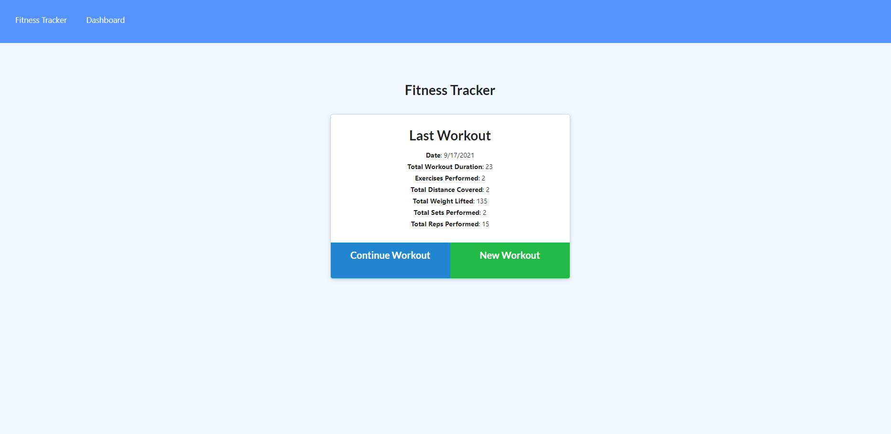
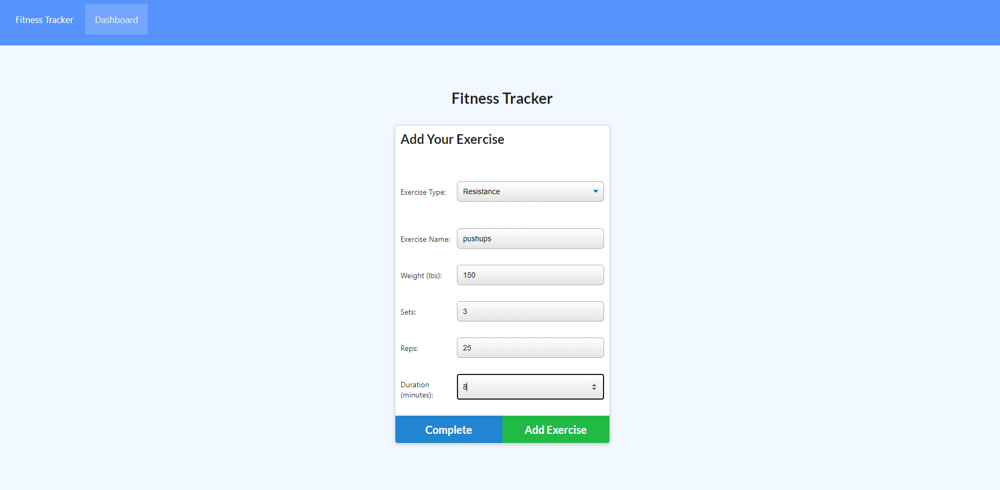
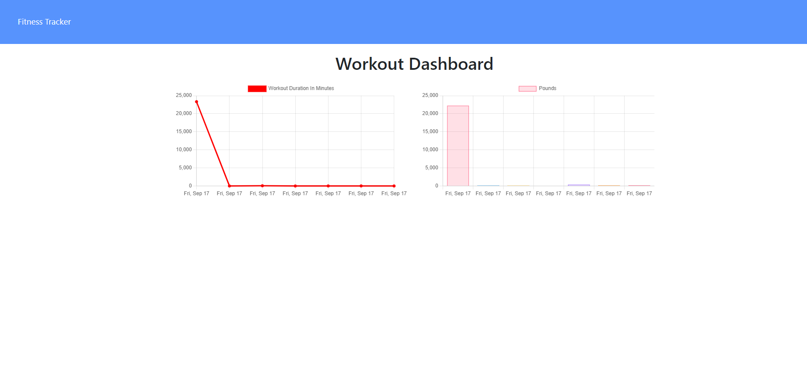

# NoSQL-Workout-Tracker
## Description
- This is a Node.js based app that uses MongoDB, Mongoose, and the Node.js framework Express to handle routes and middleware. The user is allowed to add exercises to the most recent workout plan, add new exercises to a new workout plan and view the total combined weight lifted and the total duration of each workout from the past seven days from the 'stats' page.
## Installation
- Clone this repository, run 'npm install', then 'npm run seed' to seed the MongoDB.
## Usage
- View the live application [Here](https://thawing-wave-27284.herokuapp.com) deployed at Heroku
- 
- 
- 
